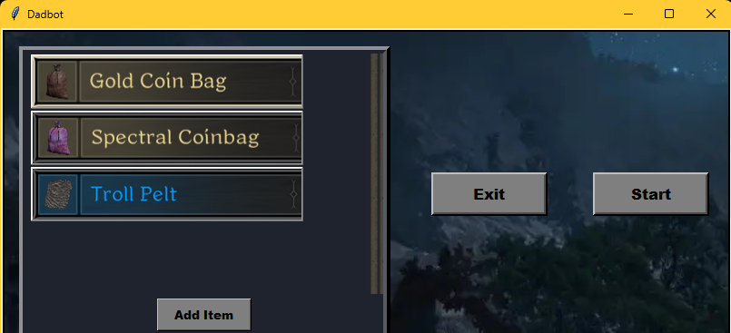

# Dark and Darker market automation experiment


A Windows-focused computer-vision experiment that reads the **Dark and
Darker** in-game marketplace with OCR, evaluates candidate trades, and uses
desktop automation to exercise a buy/relist workflow.

The project demonstrates screen-region calibration, OCR preprocessing,
template matching, market calculations, stateful control loops, a Tkinter UI,
and structured logging.

## Important notice

This project is unofficial, is not endorsed by the game’s developer, and was
built for educational experimentation. Automated interaction may violate the
game’s Terms of Service and can lead to account sanctions. Review the current
rules yourself and do not use this project against a live service unless you
have explicit permission.

The repository is not presented as a production trading tool. Its screen
coordinates and image templates are sensitive to game, resolution, UI-scale,
and marketplace changes.

## How it works

1. Capture configured regions of the game window.
2. Detect item and listing state with template matching.
3. Read numeric prices through Tesseract OCR.
4. Compare current prices with external reference data.
5. Apply profitability, balance, and sanity checks.
6. Drive the experimental workflow with keyboard and mouse automation.
7. Record decisions and failures in rotating local logs.



## Requirements

- Windows with Python 3.11 or 3.12
- [Tesseract OCR](https://github.com/UB-Mannheim/tesseract/wiki)
- a supported display layout and manually verified image templates

Install the Python dependencies in a virtual environment:

```powershell
py -3.12 -m venv .venv
.venv\Scripts\python.exe -m pip install --upgrade pip
.venv\Scripts\python.exe -m pip install -r requirements.txt
```

If `tesseract.exe` is not on `PATH`, set its path for the current PowerShell
session:

```powershell
$env:TESSERACT_CMD = "C:\Program Files\Tesseract-OCR\tesseract.exe"
```

The capture code defaults to monitor 2. Override it when needed:

```powershell
$env:DADBOT_MONITOR = "1"
```

Logs default to the repository’s ignored `logs/` directory. Set
`DADBOT_LOG_DIR` to store them elsewhere.

## Run

```powershell
.venv\Scripts\python.exe dadbot.py
```

The script now launches the Tkinter application. Press `Q` to request a clean
stop. `Ctrl+T` enables the existing diagnostic trigger.

Before any experiment, inspect the configured items, image templates, screen
regions, and price-source behavior. Keep a manual stop path available.

## Repository layout

```text
dadbot.py             # application entry point
ui.py                 # Tkinter interface
utils/actors/         # screen capture, OCR, and input automation
utils/dependents/     # calculations, persistence, and reference lookups
utils/ui_utils/       # reusable UI helpers
assets/               # documentation images
```

## Development checks

The current automated check verifies that every Python file parses:

```powershell
python -m compileall -q .
```

End-to-end tests require a controlled desktop fixture and are not yet included.

## Known limitations

- image templates and screen ratios are tied to a particular UI configuration;
- external reference pages can change without notice;
- OCR and desktop input are inherently fallible;
- there is no safe simulation backend or complete automated test suite yet.

## License

Licensed under the MIT License. See [LICENSE](LICENSE).
