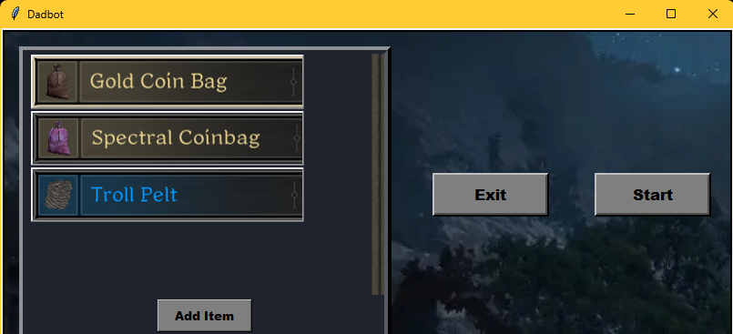

# Dark and Darker Automated Trading Bot


An automated trading bot for the game Dark and Darker that uses computer vision (pytesseract) and screen automation to identify and execute profitable trades in the in-game market.

***

## ⚠️ EXTREME WARNING: USE AT YOUR OWN RISK ⚠️

**This project is for educational purposes only. Using this bot is a direct violation of the Dark and Darker Terms of Service and will likely result in a permanent ban of your game account.** The author of this software is not responsible for any disciplinary action taken against you. You assume all risks by downloading, running, or using this code.

***

## How It Works

The bot operates as an adaptive trading agent, running through a continuous cycle of analysis and execution.

1. **Price Benchmarking**: The cycle begins by using a web scraper to gather general price categories or baseline market data from an external source. This provides a strategic foundation for its in-game decisions.

2. **Live Market Reading**: It then captures the in-game market screen and uses pytesseract (OCR) to read the current, live prices of items available for trade.

3. **Profitability & Volatility Analysis**: The bot processes the live data against the benchmark prices to identify profitable "buy low, sell high" opportunities. This core step includes a volatility calculation that determines how frequently prices are fluctuating. Based on this, the bot adapts how often it needs to re-calculate its target prices, making it more efficient.

4. **Pre-Trade Validation**: Before attempting a purchase, the bot performs a balance check to ensure it has sufficient in-game currency to complete the transaction.

5. **Automated Trading Cycle**: Once a profitable trade is validated, the bot uses pyautogui to simulate mouse and keyboard actions to:

- Buy Low: Purchase the identified undervalued item.

- Sell High: Automatically relist the same item at the ideal sell price calculated in the analysis step.

6. **Continuous Loop**: The bot repeats this entire cycle, continuously monitoring the market and adapting its strategy based on the latest data and market volatility.

## Features

* Adaptive Trading Logic: Features a dynamic volatility calculation to automatically adjust how often it re-evaluates prices, making it efficient in both stable and chaotic markets.
*     Will cancel and relist items under certain conditions
* External Price Benchmarking: Uses a web scraper to pull baseline market data, providing a strategic foundation for its in-game trading decisions.
* Real-time Data Extraction: Reads the live market directly from the screen using pytesseract (OCR) for up-to-the-second analysis.
* End-to-End Automation: Manages the entire trading lifecycle—from identifying an opportunity and validating your balance to purchasing the item and automatically relisting it for profit.
* Configurable & Resilient: Built with user-configurable settings and pre-trade sanity checks to ensure it trades safely and effectively.

## Installation & Setup [UNDER CONSTRUCTION]

1.  **Clone the repository:**
    ```bash
    git clone [https://github.com/your-username/your-repo-name.git](https://github.com/your-username/your-repo-name.git)
    cd your-repo-name
    ```
2.  **Install dependencies:** Ensure you have Python 3.x installed.
    ```bash
    pip install -r requirements.txt
    ```
3.  **Install Tesseract OCR:** You must install Google's Tesseract engine. Follow the instructions for your operating system:
    * [Windows Installer](https://github.com/UB-Mannheim/tesseract/wiki)
    * For macOS/Linux, use your package manager (e.g., `sudo apt-get install tesseract-ocr` or `brew install tesseract`).
    * **Important:** You may need to add the Tesseract installation path to your system's PATH variable.

4.  **Configure the Bot:** Open `config.ini` (or your configuration file) and adjust the settings to match your screen resolution and desired trading parameters.

## Usage

1.  Launch Dark and Darker and navigate to the trade market.
2.  Run the main Python script from your terminal:
    ```bash
    python main.py
    ```
3.  With the UI, select the item you want to trade and click Start. If you want to add a new item, select add item and follow the prompts to initialize a new item.



4.  To stop the bot, press the Q, then press Exit on the UI or close the terminal window.

## License

This project is licensed under the MIT License. See the [LICENSE](LICENSE) file for details.


